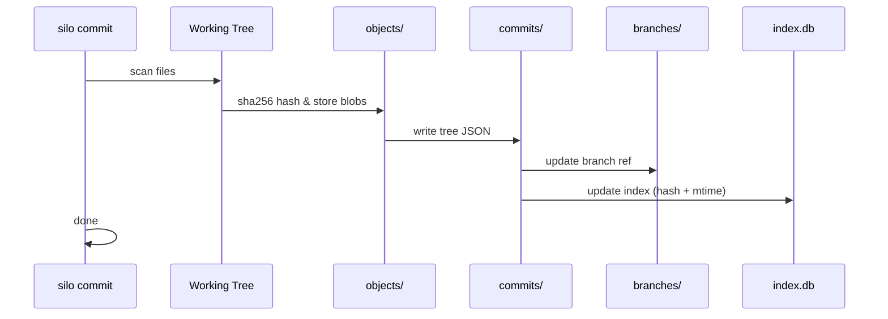
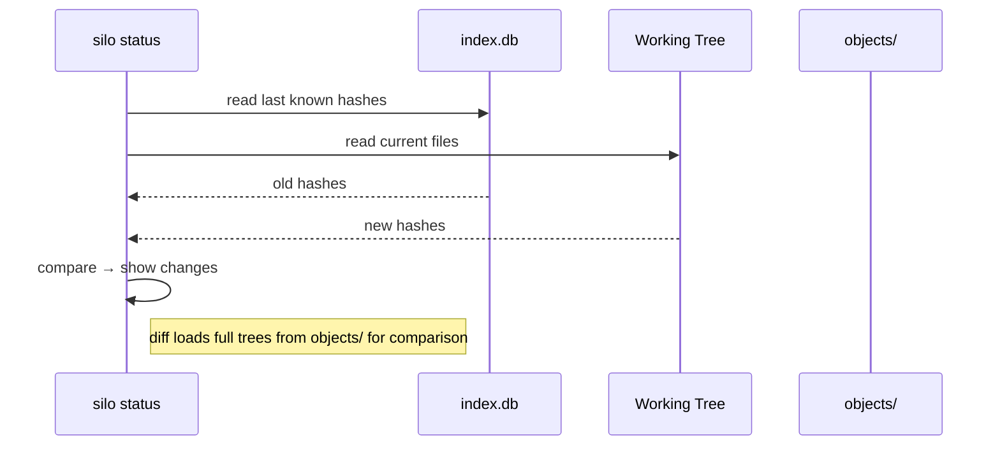
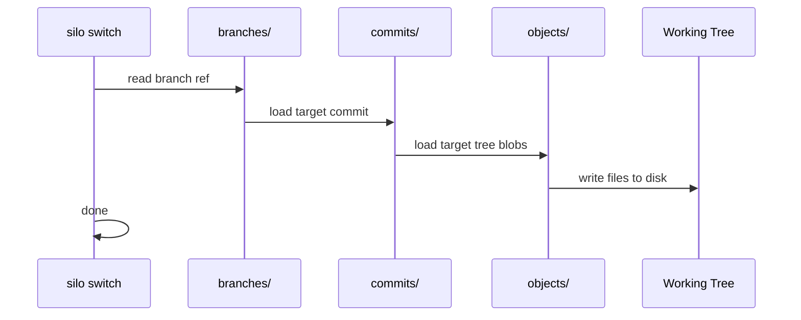
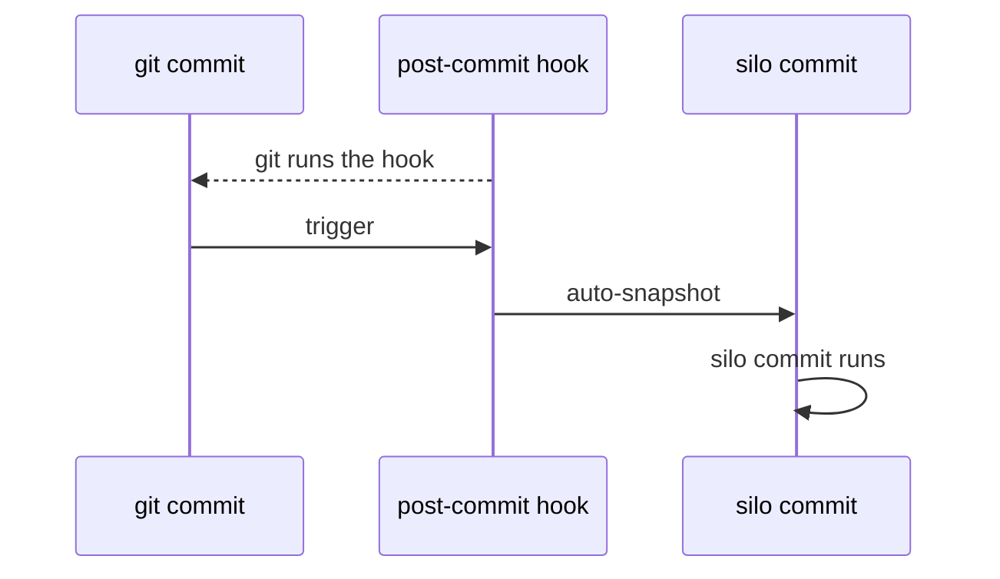
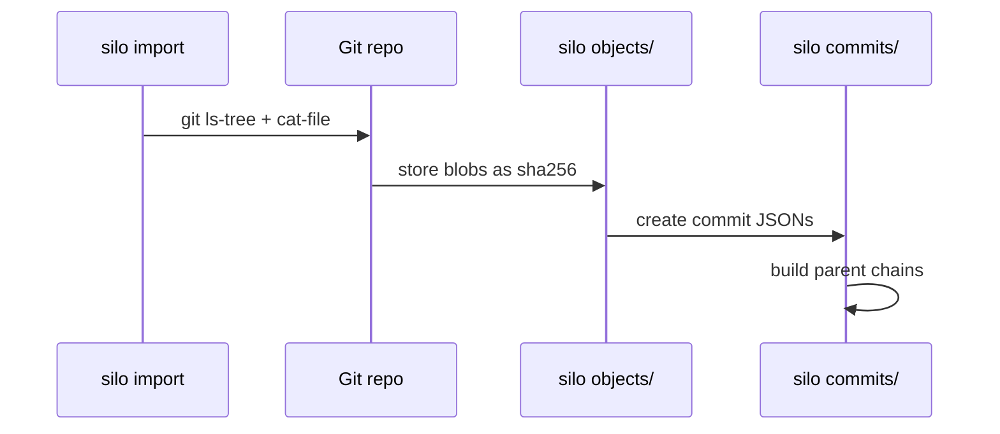

<p align="center">
A lightweight AI-first CLI tool that <code>snapshots</code> your working tree as <code>commits</code> with no server, no account, no setup - just <code>silo init</code> and you're versioning.
<br><br>

</p>
<br>

> [!IMPORTANT]\
> **Silo is free and local-first.** No GitHub, no servers, no accounts. Your data lives in `.silo/` inside your project - move it, copy it, back it up. Nothing leaves your machine.

> [!NOTE]\
> Tag and note commands use a shared `weld`/`unweld` system - attach any tag or note to individual commits or whole branches at once. See [docs/commands.md](docs/commands.md).

> [!WARNING]\
> **Silo is under active development.** Commands and storage formats may change. Not recommended for top production use yet - but perfect for experimenting and iterating on personal projects.

## Table of Contents

- [Why Silo?](#why-silo)
- [Features](#features)
- [Installation](#installation)
- [Quick Start](#quick-start)
- [How It Works](#how-it-works)
- [Development Setup](#development-setup)

## Why Silo?

I work on <u>several projects</u>, and <mark>every time</mark> something works on one and something works on another. But I <u>**don't**</u> want to `git commit` because I want to keep the git history *clean*. Creating branches for <mark>every experiment</mark> is a ***hassle***. So I used to ~~copy the whole folder~~ and recreate a <u>new one</u> to work on the same thing - *save progress*, try **another approach**, <mark>repeat</mark> until I <u>find the best</u> solution.

That's why I made **Silo** - a *local-first* <u>version manager</u>. It's **AI-first**: unlike ~~Git~~, Silo has **simpler commands** and is designed for *rapid experimentation*, and <mark>any agent</mark> can understand the syntax ~~instantly~~ <u>quickly</u>. The best feature is **`silo snapshot`**, which creates a `.tar.gz` archive of your codebase *instantly* so <mark>every iteration</mark> is saved ***without polluting your git history***. <u>No more</u> `git stash`, <u>no more</u> `git branch experiment`, ~~no more~~ ~~manual folder backups~~ - just `silo init`, `silo commit`, `silo snapshot`, and <mark>you're done</mark>.

## Features

- **`🤯 Zero infrastructure`** - no GitHub, no servers, no accounts
- **`📁 Snapshot-based`** - every commit is a full tree hash, no deltas or packfiles
- **`🤙 Portable`** - `.silo/` lives in your project, move it anywhere
- **`🌳 Branches`** - lightweight branch switching with working tree rewrite
- **`🎟️ Tags & notes`** - attach to single commits or entire branches at once
- **`✨ Bridge mode`** - auto-silo on every `git commit` via git hooks
- **`📥 Import`** - pull full history from existing Git repos or GitHub
- **`⚡ Snapshots`** - archive whole project as `.tar.gz` with `silo snapshot`

## Installation

```bash
git clone https://github.com/divyanshudhruv/silo.git
cd silo
pip install .
```

Now `silo init` from any directory creates a repository.

## Quick Start

```bash
silo init .
silo commit "first snapshot"
silo log --oneline
silo diff
silo tag v1.0 --branch main
```

| Command                             | What it does                                    |
| ----------------------------------- | ----------------------------------------------- |
| `silo init`                         | Create a new silo repo in the current directory |
| `silo commit "<msg>"`               | Snapshot all files with a message               |
| `silo log`                          | Browse commit history with tags & notes         |
| `silo diff`                         | See working tree changes vs last commit         |
| `silo show`                         | Full commit details including file changes      |
| `silo branch create <name>`         | Create a new branch                             |
| `silo switch <name>`                | Jump between branches                           |
| `silo tag weld <name> --branch <b>` | Tag every commit on a branch                    |
| `silo note add "<text>"`            | Annotate HEAD with a note                       |
| `silo snapshot`                     | Archive project as `.tar.gz`                    |

For the full reference, see **[docs/commands.md](docs/commands.md)**.

## How It Works

Silo stores everything in `.silo/` inside your project:

```
.silo/
  config.json      # name, email, settings
  HEAD             # current branch pointer
  index.db         # SQLite file index for fast status
  objects/         # content-addressed blobs (sha256)
  commits/         # commit metadata as JSON
  branches/        # branch → commit mappings
  tags/            # named references to commits
  notes/           # freeform annotations
  logs/            # audit trail
```

Every file is hashed once (sha256) and stored in `objects/`. Commits are lightweight JSON files pointing to a tree of those hashes. Status is instant - it compares current mtime/hashes against `index.db` rather than re-hashing everything.

### **Snapshot flow**



### **Status & diff**



### **Branch switch**



### **Bridge mode**



### **Import**



## Tips

- **`.siloignore`** - add patterns to exclude files (same syntax as `.gitignore`)
- **`usegitignore`** - `silo config set usegitignore true` uses `.gitignore` instead
- **Bridge mode** - `silo bridge enable` installs a git `post-commit` hook; every `git commit` auto-creates a silo commit
- **Tags on branches** - `silo tag v1.0 --branch main` attaches to every commit on `main` at once
- **NO_COLOR** - set `NO_COLOR=1` to disable colored output

## Development Setup

```bash
git clone https://github.com/divyanshudhruv/silo.git
cd silo

python -m venv .venv
# Windows: .venv\Scripts\activate
# macOS/Linux: source .venv/bin/activate

pip install -e .
```

Then run the demo suite:

```bash
python tests/run_commands.py
```
